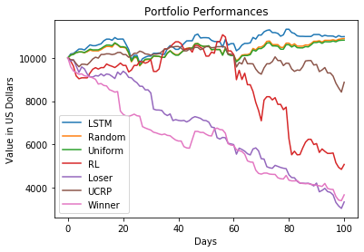
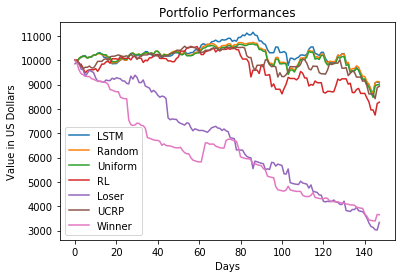

# Deep Learning Course Project Repository

## Contributors
Ku Bon Kyung, Wang Likang, Zhang Jiaxu

## Description
The main goal of the project is to use deep learning approach to construct optimal portfolio.
We use two deep learning models to construct porfolio: Reinforcement Learning and Long Short-term Memory(LSTM).
(We used open-source code for Reinforcement Learning and modified the code, so the code is not here)

## Method
### LSTM Approach
- We trained seq2seq LSTM model which uses past 50 days to predict next 5 days prices.
- We generated predictions for all companies.
- Using those predictions, we calculate the Return-To-Volatility Ratio (Sharpe Ratio).
- We believed that Return-To-Volatility would help to predict a more stably increasing stock. 
- We rebalanced the portfolio every week and picked top 10 stocks with highest Return-To-Volatility Ratio (but not negative ratios)
- (We omitted transaction costs for simplicity but we believe that it should also have some significant influence in the results.)
- We used uniform and random portfolio benchmarks so compare the results. 

### Reinforcement Learning
- We adopted reinforcement learning model proposed by Liang [1] and modified the model for our system.
- In the reinforcement learning approach, we had following settings
```
Reinforcement Learning Setting

Goal: Maximise Profit

Universe: Stocks in NASDAQ100
State: Current Portfolio and Stock Information (Price, Volume, Other Indicators)
Reward: Profit (+/-)
Action: Rebalance Portfolio

```
- We limited the number of options of stocks to 20 in order to limit the dimensionality of action space
- We also made the rebalancing (actions) to be done only in discrete amounts to limit the dimensionality of action space

## Results
### Backtest 1
- Backtest Period: from "2018-01-01" to "2018-05-29"



### Backtest 2
- Backtest Period: from "2018-06-01" to "2018-12-30"




## Discussion
### Results of LSTM approach
- Since the future prices are not only determined by the past prices but other external factors as well, 
predictions from the model could not guide the portfolio towards profits.
- We tried to use Return-To-Volatility as an indicator to find more stable stocks so that the risks from predictions 
might be alleviated. However, that might not have been enough as well.

### Results of Reinforcement Learning approach
- Our RL model seemed to show some "breakeven" performance but lost at the end.
- We believe that RL was constrainted in many ways (e.g. number of stocks options and discrete amounts for rebalancing) and that could be a reason for the loss.

## References
[1] Z. Liang, H. Chen, J. Zhu, K. Jiang, and Y. Li.  Adversarialdeep reinforcement learning in portfolio management, 2018
